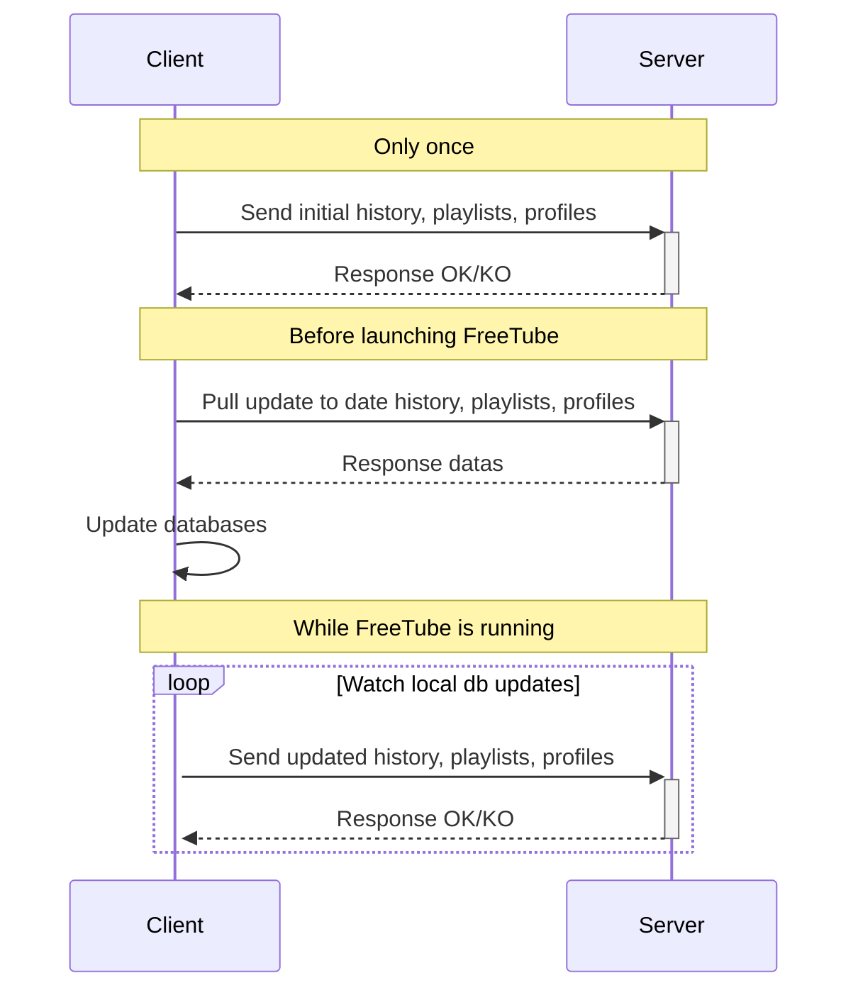

# FreeTube Sync

[FreeTube](https://freetubeapp.io/) is an open source desktop YouTube player built with privacy in mind. Use YouTube without advertisements and prevent Google from tracking you with their cookies and JavaScript. 

It does not require an account, all datas are on your local storage. In case of you use FreeTube on several computers, you can't synchronize them easily. FreeTube stores datas on plain text files, loaded in memory and rewrite them on each updates.

**FreeTube Sync** tries to solve this problem.

## What are requirements?

**FreeTube Sync** requires a server accessible by all machines running FreeTube (on a local network, through a VPN or on the web).

## How does it work?

The role of the server is to store the history, the playlists and the profiles of FreeTube instances (clients).

After starting the server, each client must init its local datas on the server. This action must be processed only once.
At each time you want to use FreeTube, you have to pull datas from the server before. A watcher will push updates on the server when your history, your playlists or your profiles are updated.
When FreeTube is restarted, history, playlists and profiles will be updated.

