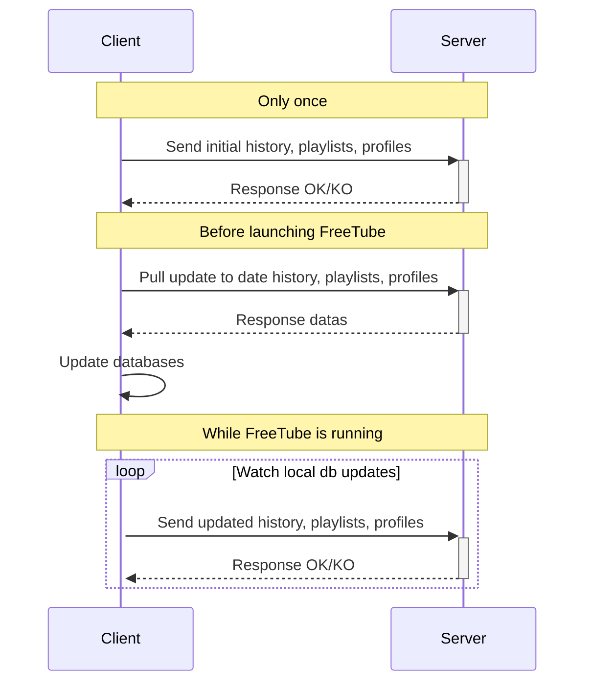

 

[FreeTube](https://freetubeapp.io/) is an open source desktop YouTube player built with privacy in mind. Use YouTube without advertisements and prevent Google from tracking you with their cookies and JavaScript.

It does not require an account, all datas are on your local storage. In case of you use FreeTube on several computers, you can't synchronize them easily. FreeTube stores datas on plain text files, loaded in memory and rewrite them on each updates.

**FT-Sync** tries to solve this problem.

## ⚠️  Disclaimer

**FT-Sync is not a project maintained by the FreeTube Team. This project is still experimental and problems may occur. I cannot be held responsible for any possible loss of data.** Feel free to [open an issue here](https://gitnet.fr/deblan/ft-sync/issues) in case of problem.**

## ⚙️ What are requirements?

**FT-Sync** requires a server accessible by all machines running FreeTube (on a local network, through a VPN or on the web).

## 🧬 How does it work?

The role of the server is to store the history, the playlists and the profiles of FreeTube instances (clients).

After starting the server, each client must initialize their local datas on the server. This action must be processed only once.
At each time you want to use FreeTube, you have to pull datas from the server before. A watcher will push updates on the server when your history, your playlists or your profiles are updated.
When FreeTube is restarted, history, playlists and profiles will be updated.



## 📗 How to use it?

Go to [releases](https://gitnet.fr/deblan/freetube-sync/releases) and download the client and the server according of your system architecture.

On the server:

```bash
chmod +x ftsync-server-xxx
sudo mv ftsync-server-xxx /usr/local/bin/ftsync-server
```

On clients:

```
chmod +x ftsync-client-xxx
sudo mv ftsync-client-xxx /usr/local/bin/ftsync-client
```

### Server

To start the server, simply run:

```
ftsync-server
```

By default, it listens on all interfaces, port 1323.

⚠️ Consider installing a proxy to secure access (HTTPS, IP access restriction, …).

### Client

First, sync your local datas to the server:

```
ftsync-client -s http://ip.of.the.server:1323 init
```

Create `~/.bin/freetube-wrapper` and fill it with:

```
#!/bin/sh

ftsync-client -s http://ip.of.the.server:1323 pull
exec freetube $@
```

Then run `chmod +x ~/.bin/freetube-wrapper`.

Create `~/.local/share/applications/FreeTubeSync.desktop` and fill it with:

```
[Desktop Entry]
Type=Application
Icon=freetube
Terminal=false
Exec=/home/foo/.bin/freetube-wrapper
Name=FreeTube (synced)
```

Create `~/.config/systemd/user/ftsync-watcher.service` and fill it with:

```
[Unit]
Description=FTSync Watcher

[Service]
Type=simple
StandardOutput=journal
ExecStart=freetube-sync-client -s http://ip.of.the.server:1323 watch
Restart=on-failure
RestartSec=1s

[Install]
WantedBy=default.target
```

Then run:

```
systemctl --user daemon-reload
systemctl --user start ftsync-watcher.service
```

Choose `FreeTube (synced)` to open FreeTube.

## 🧪 Compilation sources

- [GO 1.23](https://go.dev/dl/)
- `build-essential`
- `gcc-arm-linux-gnueabihf` in case of cross compilation

```bash
git clone https://gitnet.fr/deblan/freetube-sync
cd freetube-sync
make
```
