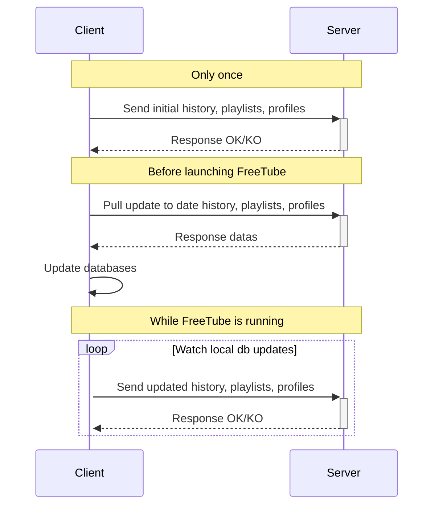

# FreeTube sync

```mermaid
sequenceDiagram
    participant Client
    participant Server

    Note over Client, Server: Only once
    Client->>+Server: Send initial history, playlists, profiles
    Server-->>-Client: Response OK/KO

    Note over Client, Server: Before launching FreeTube
    Client->>+Server: Pull update to date history, playlists, profiles
    Server-->>-Client: Response datas
    Client->>+Client: Update databases

    Note over Client, Server: While FreeTube is running
    loop Watch local db updates
        Client->>+Server: Send updated history, playlists, profiles
        Server-->>-Client: Response OK/KO
    end
```
